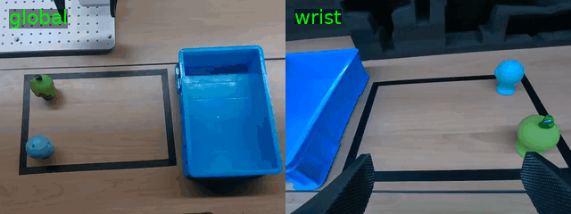

# Piper SmolVLA

Piper SmolVLA is a real-robot data collection, training, and deployment workspace for
AgileX Piper with LeRobot/SmolVLA. The current setup is built around a two-camera
RealSense rig and language-conditioned manipulation data.

The project keeps the robot interface, camera interface, dataset schema, and rollout
safety gates explicit so that collection and deployment use the same assumptions.

## Demo Preview

Real dual-camera demonstration from the sample dataset, showing the target behavior
that the SmolVLA policy is trained to reproduce.



## What This Repo Contains

| Area | Purpose |
| --- | --- |
| `src/piper_smolvla/` | Piper schema, units, validation, hardware adapters, camera sources, policy IO, and rollout safety utilities. |
| `src/piper_smolvla/cameras/` | Shared camera defaults and RealSense/V4L2 camera implementations used by collection, preview, and deployment. |
| `scripts/record_two_object_language_random.py` | Main real-robot collector for balanced blue/green two-object language data. |
| `scripts/preview_cameras.py` | Live global/wrist camera preview using the same camera source as collection and deployment. |
| `scripts/deploy_smolvla.py` | SmolVLA real-hardware rollout entrypoint with dry-run and explicit action gates. |
| `scripts/run_train_4090_smolvla_twoobj200.sh` | 4090-server SmolVLA fine-tuning wrapper for the two-object dataset. |
| `tests/` | Unit tests for schema, camera utilities, dataset writing, policy IO, training adapters, and rollout safety. |
| `docs/` | Design notes, reference audits, and adapter framework records. |

## Current Hardware Profile

The current real setup is centralized in
[`src/piper_smolvla/cameras/config.py`](src/piper_smolvla/cameras/config.py).

| Item | Default |
| --- | --- |
| Global camera | `realsense:243222074879` Intel RealSense D435I |
| Wrist camera | `realsense:260322275595` Intel RealSense D405 |
| Image size | `640x480` |
| Camera FPS | `30` |
| Dataset FPS | `20` |
| Deployment rate | `20 Hz` |
| Robot state/action order | `[j1, j2, j3, j4, j5, j6, gripper]` |
| Joint units | radians |
| Gripper unit | meters |

Keep these defaults aligned when collecting data, training policies, and deploying on
the real robot. If the camera serials change, update `cameras/config.py` first instead
of adding long command-line overrides everywhere.

## Installation

Create or activate a Python environment, then install this workspace in editable mode.

```bash
cd ~/piper-smallvla
python -m pip install -e ".[dev,hardware,realsense,train]"
```

LeRobot is not installed from PyPI in this project. Install the LeRobot version used by
your environment separately, then verify the import:

```bash
python - <<'PY'
import lerobot
print(lerobot.__version__)
PY
```

For real Piper hardware, make sure SocketCAN is up before reading or writing robot
state:

```bash
sudo ip link set can0 up type can bitrate 1000000
```

## Camera Preview

Use this first after plugging in the cameras. It uses the same `RealCameraSource` path
as collection and deployment.

```bash
python scripts/preview_cameras.py
```

On a headless machine or an environment without OpenCV GUI support:

```bash
python scripts/preview_cameras.py --snapshot-only
```

For deeper camera debugging:

```bash
python scripts/debug_cameras.py --list-only
python scripts/debug_cameras.py --snapshot-only
```

## Two-Object Language Data Collection

Dry-run first. This checks cameras, schema, writer compatibility, start state, and
the balanced blue/green schedule without recording real episodes.

```bash
python scripts/record_two_object_language_random.py \
  --dataset-root data/two_obj_random_language_200 \
  --dry-run \
  --no-robot-write
```

Record or resume the real dataset:

```bash
python scripts/record_two_object_language_random.py \
  --dataset-root data/two_obj_random_language_200 \
  --resume \
  --preview
```

Useful defaults:

- `--fps 20`
- `--camera-fps 30`
- `--num-blue 100`
- `--num-green 100`
- `--global-camera realsense:243222074879`
- `--wrist-camera realsense:260322275595`

The collector writes LeRobot v3-style data and stores collection metadata under the
dataset root. The `data/` directory is ignored by Git on purpose.

## Sample Dataset

This repository includes a small real-data sample at:

```text
sample_data/two_obj_language_200_sample10
```

It contains 10 real episodes from the blue/green two-object collection:

- 5 blue-object episodes
- 5 green-object episodes
- 2126 frames
- 20 FPS
- dual-camera videos for `observation.images.global_rgb` and `observation.images.wrist_rgb`
- LeRobot-style `data/`, `meta/`, and `videos/` directories

The full local dataset is intentionally not committed because it is much larger. Use
the sample for repository inspection, schema checks, and lightweight loader tests.

## Training on the 4090 Server

The training wrapper expects a 4090 workspace layout like:

```text
~/q_ws/
  datasets/two_obj_language_200
  models/smolvla_base
  scripts/q_smolvla_train.py
```

Run a preflight check and one-step smoke test:

```bash
bash scripts/run_train_4090_smolvla_twoobj200.sh
```

Start the full 100k-step run:

```bash
START_TRAINING=1 bash scripts/run_train_4090_smolvla_twoobj200.sh
```

Run it in the background:

```bash
mkdir -p logs
setsid env START_TRAINING=1 bash scripts/run_train_4090_smolvla_twoobj200.sh \
  > logs/smolvla_twoobj200_170ep_20hz_100k_b4_4090.nohup.log 2>&1 < /dev/null &
tail -f logs/smolvla_twoobj200_170ep_20hz_100k_b4_4090.log
```

The wrapper checks episode count, frame count, task count, FPS, required features, and
the LeRobot image feature compatibility patch before starting the real run.

## Deployment

Always run a dry-run first. Dry-run loads the checkpoint, reads cameras and robot
state, runs policy inference, and logs outputs without sending real robot commands.

```bash
python scripts/deploy_smolvla.py \
  --checkpoint checkpoints/YOUR_RUN/checkpoints/last/pretrained_model \
  --dataset data/two_obj_random_language_200 \
  --task "Pick up the blue object and put it into the box." \
  --dry-run \
  --auto-start \
  --save-final-images
```

Real rollout is protected by two explicit flags:

```bash
python scripts/deploy_smolvla.py \
  --checkpoint checkpoints/YOUR_RUN/checkpoints/last/pretrained_model \
  --dataset data/two_obj_random_language_200 \
  --task "Pick up the blue object and put it into the box." \
  --allow-hardware-action \
  --confirm-policy-rollout ROLLOUT
```

The deployment path includes start-state checks, per-step action clamps, wrist freeze,
EMA smoothing, stagnation detection, ready-stop logic, and optional rollout logging.

## Safety Notes

- Keep emergency stop reachable whenever real hardware is powered.
- Use `--dry-run` before every new checkpoint or prompt.
- Keep collection FPS and deployment rate aligned for the dataset being used.
- Keep camera serials and camera FPS aligned across preview, collection, and deployment.
- Do not commit real datasets, model checkpoints, rollout videos, or logs.

## Git Hygiene

Ignored by default:

```text
data/
outputs/
checkpoints/
wandb/
*.safetensors
*.pt
*.pth
*.log
logs_*.txt
```

Before pushing:

```bash
python -m pytest -q
git diff --check
git status --short
```

## Documentation

- [Piper + SmolVLA Adapter Framework](docs/PIPER_SMOLVLA_ADAPTER_FRAMEWORK.md)
- [Phase 0 Report](docs/PIPER_SMOLVLA_PHASE0_REPORT.md)
- [Reference Audit](docs/PIPER_SMOLVLA_REFERENCE_AUDIT.md)

## Project Status

This is an active real-robot research workspace, not an official AgileX or Hugging Face
package. The safest path is to treat every hardware command as experimental until it
has passed camera preview, dry-run, and start-state checks on the exact robot setup.
